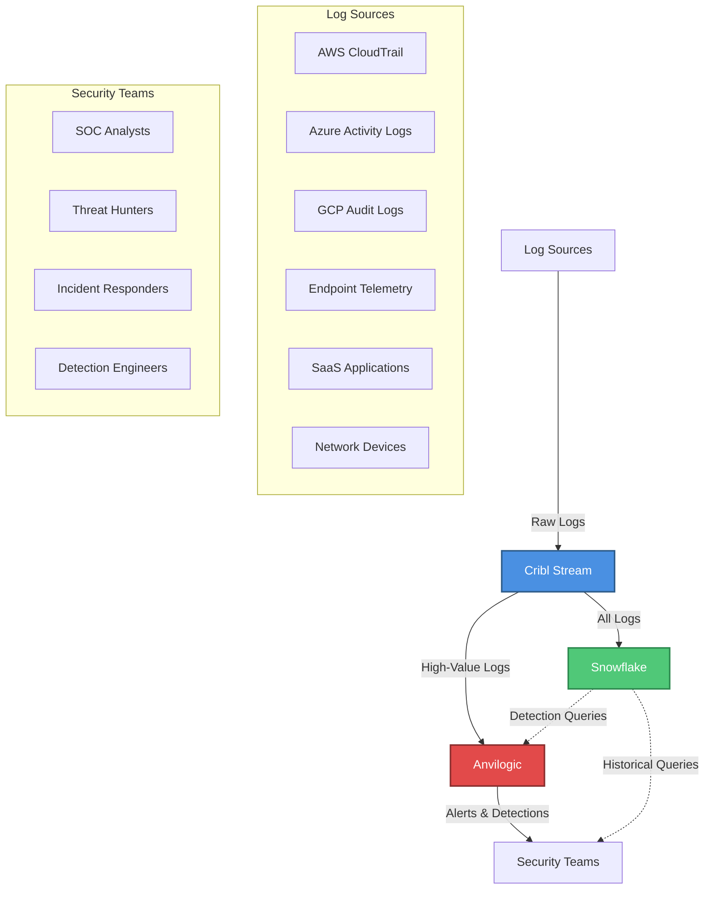
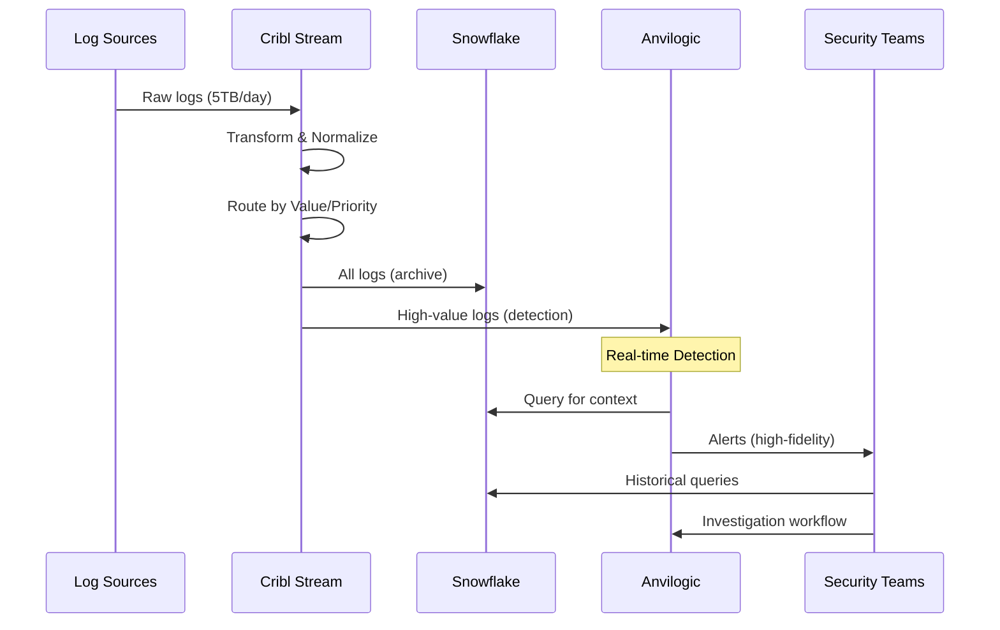
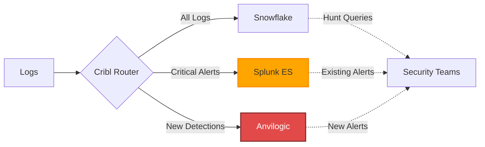

# Modern Decoupled Detection Architecture

## Technical Overview & Business Case

> A strategic analysis of modern decoupled detection architecture, examining components, cost benefits, and adoption strategies for organizations transitioning from monolithic SIEM platforms like Splunk.

**Author:** Mark Hwang  
**Context:** Security Architecture Documentation  
**Date:** January 2025  
**Focus:** Cribl, Snowflake, Anvilogic Integration

-----

## Table of Contents

1. [Executive Summary](#executive-summary)
1. [Architecture Overview](#architecture-overview)
1. [Component Deep-Dive](#component-deep-dive)
1. [Monolithic vs. Decoupled Comparison](#monolithic-vs-decoupled-comparison)
1. [Cost-Benefit Analysis](#cost-benefit-analysis)
1. [Adoption & Change Management](#adoption--change-management)
1. [Implementation Recommendations](#implementation-recommendations)
1. [About This Document](#about-this-document)

-----

## Executive Summary

Modern decoupled detection architecture represents a fundamental shift in how organizations approach security monitoring and threat detection. By separating log storage, detection logic, and analysis platforms, organizations achieve cost optimization, operational flexibility, and detection capabilities impossible with traditional monolithic SIEMs.

**Key Benefits:**

- **80%+ cost reduction** compared to traditional SIEM platforms
- **10x longer data retention** at the same or lower cost
- **Platform independence** - detection logic portable across tools
- **Scalability** - storage and compute scale independently
- **Operational focus** - teams focus on detection quality, not infrastructure management

This document outlines the architectural components of a modern detection infrastructure (Cribl, Snowflake, Anvilogic), provides detailed cost analysis, and addresses common adoption challenges when transitioning from platforms like Splunk Enterprise Security.

**Based on real-world experience** leading similar migrations at enterprise financial institutions, including lessons learned, resistance patterns, and proven strategies for successful adoption.

-----

## Architecture Overview

### High-Level Architecture



### Data Flow Architecture



### Key Architectural Principles

1. **Separation of Concerns**
- Storage layer (Snowflake) independent of detection logic (Anvilogic)
- Log routing (Cribl) decoupled from both storage and detection
- Each component optimized for its specific function
1. **Cost Optimization Through Intelligence**
- Not all logs need real-time detection processing
- Not all logs need expensive storage
- Route data based on value, not volume
1. **Query-on-Demand Model**
- Store everything cheaply
- Compute only when needed
- Pay for questions asked, not data stored
1. **Platform Independence**
- Detection rules not tied to proprietary query languages
- Data accessible to multiple analytics platforms
- Flexibility to swap components as technology evolves

-----

## Component Deep-Dive

### Cribl Stream (Log Router)

**Purpose:** Intelligent log routing and transformation layer

**Core Capabilities:**

- **Universal ingestion** - Accepts logs from any source in any format
- **Real-time transformation** - Parse, normalize, enrich in-flight
- **Smart routing** - Send different logs to different destinations based on rules
- **Data reduction** - Drop noise, sample verbose logs, compress intelligently
- **Format conversion** - Output in format required by destination

**Value Proposition:**

- Decouples log sources from destinations (add/remove either independently)
- Reduces costs by routing intelligently (high-value to detection, archive to cheap storage)
- Improves data quality through normalization before storage
- Enables gradual migration (route old logs to Splunk, new logs to modern stack)

**Common Use Cases:**

```
IF log_type == "CloudTrail" AND event_name IN privilege_escalation_events:
    → Route to Anvilogic (real-time detection)
    → Route to Snowflake (archive)

IF log_type == "VPC_Flow" AND traffic == "allowed":
    → Sample 1% (reduce volume)
    → Route to Snowflake only (no real-time detection needed)

IF log_type == "application_debug":
    → Drop entirely (no security value)
```

**Operational Model:**

- Managed SaaS or self-hosted
- Scales horizontally (add workers as volume increases)
- Minimal operational overhead (stateless, resilient)

-----

### Snowflake (Data Lake)

**Purpose:** Cost-efficient storage for massive log volumes with on-demand query capability

**Core Capabilities:**

- **Separation of storage and compute** - Pay for each independently
- **Automatic scaling** - Compute scales up/down based on query load
- **Time-travel** - Query historical data states (useful for investigations)
- **Data sharing** - Share datasets across teams/tools without copying
- **Semi-structured data support** - Native JSON/AVRO handling (perfect for logs)

**Value Proposition:**

- **Storage costs ~$23/TB/month** (vs. Splunk ~$1000+/TB/month)
- Retain years of data affordably (vs. typical 90-day retention in traditional SIEMs)
- Query only when needed (vs. paying for indexing regardless of use)
- Separate hot/warm/cold tiers automatically

**Data Model for Detection:**

```sql
-- Raw logs table (as ingested from Cribl)
CREATE TABLE security_logs.raw_events (
    timestamp TIMESTAMP_NTZ,
    source_type VARCHAR,
    event_data VARIANT,  -- JSON blob
    enrichment_data VARIANT,
    ingestion_time TIMESTAMP_NTZ DEFAULT CURRENT_TIMESTAMP()
)
PARTITION BY (DATE(timestamp), source_type);

-- Normalized detection view (optimized for Anvilogic queries)
CREATE VIEW security_logs.detection_events AS
SELECT 
    timestamp,
    source_type,
    event_data:eventName::STRING as event_name,
    event_data:userIdentity::VARIANT as user_identity,
    event_data:sourceIPAddress::STRING as source_ip,
    event_data:requestParameters::VARIANT as request_params,
    -- ... more normalized fields
FROM security_logs.raw_events
WHERE source_type IN ('CloudTrail', 'AzureActivityLog', 'GCPAuditLog');
```

**Query Performance Optimization:**

- **Clustering keys** - Organize data by commonly filtered fields (timestamp, source_type)
- **Materialized views** - Pre-compute common aggregations for threat hunting
- **Result caching** - Identical queries return instantly (24-hour cache)
- **Query pruning** - Partitioning eliminates scanning irrelevant data

**Cost Management:**

- **Compute auto-suspend** - Warehouse shuts down after inactivity (default: 10 minutes)
- **Automatic query optimization** - Query optimizer chooses efficient execution plans
- **Storage compression** - Typical 3-4x compression on log data
- **Time-based tiering** - Older data moved to cheaper storage tiers automatically

-----

### Anvilogic (Detection Platform)

**Purpose:** Modern detection engineering platform with MITRE ATT&CK alignment

**Core Capabilities:**

- **Detection-as-code** - Rules defined in structured format (JSON/YAML)
- **MITRE ATT&CK native** - Built-in mapping to tactics/techniques
- **Multi-platform queries** - Query Snowflake, Splunk, other sources from single platform
- **Automated testing** - Validate detection logic before deployment
- **Detection analytics** - Track coverage, efficacy, false positive rates

**Value Proposition:**

- Focus on detection quality, not infrastructure management
- Portable detection logic (not locked into proprietary query language)
- Comprehensive MITRE coverage tracking (identify gaps systematically)
- Collaboration features (detection engineers work together on rules)

**Detection Rule Architecture:**

```yaml
detection_rule:
  metadata:
    name: "AWS IAM Privilege Escalation via Policy Attachment"
    mitre_attack:
      - "T1098.001"  # Account Manipulation
    severity: high
    
  data_sources:
    - platform: snowflake
      query: |
        SELECT * FROM detection_events
        WHERE event_name IN ('AttachUserPolicy', 'PutUserPolicy')
          AND request_params:policyArn LIKE '%AdministratorAccess%'
          AND timestamp > DATEADD(minute, -5, CURRENT_TIMESTAMP())
    
  detection_logic:
    conditions:
      - field: user_identity.principalId
        operator: not_in
        value: known_admin_roles
        
  response:
    severity: high
    actions:
      - alert_soc
      - notify_identity_team
    
  false_positive_reduction:
    exclude_if:
      - scheduled_automation_accounts
      - terraform_service_principals
```

**Integration Model:**

- **API-first** - All operations available via REST API (enables GitOps workflows)
- **Webhook alerts** - Send detections to SOAR, ticketing, Slack
- **Data source agnostic** - Can query Snowflake, Splunk, Sentinel simultaneously
- **Version control ready** - Detection rules in Git, deployed via CI/CD

**Operational Benefits:**

- **No infrastructure management** - SaaS platform, no servers to maintain
- **Scales automatically** - Add detection rules without capacity planning
- **Built-in metrics** - Alert volume, detection coverage, time-to-detect
- **Collaborative** - Multiple engineers work on detection library simultaneously

-----

## Monolithic vs. Decoupled Comparison

### Side-by-Side Analysis

|Dimension                      |Monolithic SIEM (Splunk ES)                                   |Decoupled Architecture (Cribl + Snowflake + Anvilogic)|
|-------------------------------|--------------------------------------------------------------|------------------------------------------------------|
|**Cost Model**                 |Pay per GB ingested (~$1000/TB/month)                         |Storage ~$23/TB/month + compute on-demand             |
|**Typical 5TB/day Annual Cost**|~$1.8M - $2M+                                                 |~$400K - $500K                                        |
|**Data Retention Economics**   |90 days typical (cost prohibitive beyond)                     |365+ days standard (affordable at scale)              |
|**Scalability**                |Limited by license/hardware, expensive to scale               |Independent scaling of storage/compute/detection      |
|**Vendor Lock-in**             |High (SPL-specific rules, platform-dependent)                 |Low (portable detection logic, swappable components)  |
|**Detection Logic Portability**|Locked to SPL syntax                                          |Platform-agnostic (YAML/JSON rules)                   |
|**Infrastructure Overhead**    |Significant (indexers, search heads, forwarders)              |Minimal (managed services, stateless components)      |
|**Query Performance**          |Fast on hot data, slow on older data                          |Consistent performance with proper optimization       |
|**Threat Hunting Capability**  |Limited by retention costs                                    |Hunt across years of data affordably                  |
|**Operational Complexity**     |Infrastructure management burden (capacity planning, upgrades)|Focus on detection logic, not infrastructure          |
|**Flexibility**                |All-or-nothing (data in Splunk or not)                        |Tiered storage, selective real-time detection         |
|**Learning Curve**             |SPL query language                                            |SQL (familiar), platform-specific features            |
|**Multi-Cloud Support**        |Add-on costs for cloud log ingestion                          |Native cloud log ingestion, no upcharges              |
|**Detection Coverage Tracking**|Manual spreadsheets/dashboards                                |Built-in MITRE ATT&CK coverage metrics                |

### Fundamental Paradigm Shift

**Traditional Approach (Monolithic):**

```
Pay per GB ingested → Expensive forever → Limited retention → Less hunting capability
```

**Modern Approach (Decoupled):**

```
Pay for storage cheaply → Compute on-demand → Unlimited retention → Enhanced hunting
```

### When Monolithic Makes Sense

Despite the advantages of decoupled architecture, monolithic SIEMs remain appropriate for:

- **Small organizations (<1TB/day)** - Setup complexity may outweigh cost savings
- **Single-platform shops** - If all tooling is Splunk-based, consolidation has value
- **Mature SPL expertise** - Significant investment in SPL knowledge and content
- **Compliance requirements** - Some regulations specifically certify traditional SIEMs
- **Rapid deployment needs** - Monolithic platforms faster to stand up initially

### Migration Strategy: Hybrid Approach

Many organizations run hybrid architectures during transition:



**Benefits of hybrid approach:**

- Maintain existing Splunk detections while building new ones in Anvilogic
- Gradual user migration (SOC continues using familiar tools)
- Reduced risk (fallback to Splunk if issues arise)
- Prove value incrementally (cost savings realized immediately on storage)

-----

## Cost-Benefit Analysis

### Scenario: Enterprise with 5TB/Day Log Volume

**Assumptions:**

- 5TB/day average log volume (typical mid-to-large enterprise)
- Mix of cloud infrastructure, endpoints, SaaS, network logs
- 100-person SOC team (analysts, engineers, hunters, responders)
- Current state: Splunk Enterprise Security

### Traditional Monolithic SIEM (Splunk ES)

**Storage/Licensing Costs:**

```
Daily ingestion: 5TB/day × 30 days = 150TB/month
Splunk licensing: ~$1000/TB/month
Monthly storage: 150TB × $1000 = $150,000/month
Annual storage: $1,800,000/year

Typical retention: 90 days (cost-prohibitive beyond)
Total data under management: 450TB
```

**Infrastructure Costs:**

```
Indexer cluster (8 nodes): $200,000/year (hardware/cloud)
Search head cluster (4 nodes): $100,000/year
Forwarders (1000+ endpoints): Included in license
Total infrastructure: ~$300,000/year
```

**Personnel Costs:**

```
Platform administration: 2-3 FTE (Splunk admins)
Estimated cost: 2.5 FTE × $150K = $375,000/year
```

**Total Annual Cost: ~$2.5M/year**

**Limitations:**

- 90-day retention only
- Expensive to hunt (each query consumes licensing)
- Scaling requires license upgrades (step-function costs)
- Platform administration overhead significant

-----

### Decoupled Architecture (Cribl + Snowflake + Anvilogic)

**Storage Costs (Snowflake):**

```
Daily ingestion: 5TB/day × 30 days = 150TB/month
Snowflake storage: ~$23/TB/month
Monthly storage: 150TB × $23 = $3,450/month
Annual storage: $41,400/year

Retention: 365 days (4x more data than Splunk)
Total data under management: 1,825TB (vs. 450TB in Splunk)
```

**Compute Costs (Snowflake):**

```
Detection queries (Anvilogic): ~$5,000/month
Ad-hoc investigations: ~$3,000/month
Threat hunting: ~$2,000/month
Total monthly compute: ~$10,000/month
Annual compute: $120,000/year
```

**Platform Costs:**

```
Cribl Stream: ~$50,000/year (enterprise license)
Anvilogic platform: ~$200,000/year (detection engineering + SOAR)
Total platform licensing: $250,000/year
```

**Infrastructure Costs:**

```
Cribl workers (managed service): Included in license
Snowflake infrastructure: Included in storage/compute costs
Anvilogic infrastructure: SaaS (included)
Total infrastructure: $0 (fully managed services)
```

**Personnel Costs:**

```
Platform administration: 0.5 FTE (minimal operational overhead)
Estimated cost: 0.5 FTE × $150K = $75,000/year
```

**Total Annual Cost: ~$486,000/year**

-----

### Cost Comparison Summary

|Cost Component        |Monolithic (Splunk)|Decoupled Architecture|Savings             |
|----------------------|-------------------|----------------------|--------------------|
|**Storage**           |$1,800,000         |$41,400               |$1,758,600 (98%)    |
|**Compute**           |Included           |$120,000              |N/A                 |
|**Platform Licensing**|Included           |$250,000              |N/A                 |
|**Infrastructure**    |$300,000           |$0                    |$300,000 (100%)     |
|**Personnel**         |$375,000           |$75,000               |$300,000 (80%)      |
|**TOTAL**             |**$2,475,000**     |**$486,400**          |**$1,988,600 (80%)**|

### Non-Monetary Benefits

**Operational Improvements:**

- **4x data retention** - Hunt across 365 days instead of 90 days
- **Faster threat hunting** - Snowflake optimized for ad-hoc queries
- **Better detection quality** - Focus on logic, not infrastructure management
- **Scalability** - Add data sources without capacity planning
- **Flexibility** - Swap components without vendor lock-in

**Security Improvements:**

- **Increased coverage** - Ingest more log sources affordably
- **Longer investigations** - Historical context for incident response
- **Proactive hunting** - Cost-effective to hunt regularly
- **Detection maturity** - MITRE ATT&CK tracking and gap analysis

**Organizational Benefits:**

- **Reduced toil** - Detection engineers focus on detection, not platform
- **Faster onboarding** - SQL more accessible than SPL for new analysts
- **Better collaboration** - Detection-as-code enables GitOps workflows
- **Cloud-native** - Aligns with broader cloud adoption strategy

### ROI Timeline

```
Initial investment (Year 1): ~$500K (platform costs + migration effort)
Annual recurring: ~$486K (ongoing operational costs)
Annual savings vs. Splunk: ~$2M

ROI achieved: Within 3-4 months of full migration
5-year TCO savings: ~$10M
```

### Cost Sensitivity Analysis

**What if log volume doubles (10TB/day)?**

|Component  |Splunk Cost (10TB/day)|Decoupled Cost (10TB/day)|
|-----------|----------------------|-------------------------|
|Storage    |$3,600,000/year       |$82,800/year             |
|Compute    |N/A                   |$240,000/year            |
|Other      |$675,000/year         |$325,000/year            |
|**TOTAL**  |**$4,275,000/year**   |**$647,800/year**        |
|**Savings**|N/A                   |**$3,627,200/year (85%)**|

**Key insight:** Savings *increase* as data volume grows (decoupled architecture scales more efficiently)

-----

## Adoption & Change Management

### Common Resistance Patterns

Based on real-world migration experience, expect resistance from multiple stakeholder groups:

#### 1. SOC Analysts: “I know Splunk, now I need to learn something new”

**Resistance drivers:**

- Comfort with SPL query language
- Muscle memory with Splunk UI
- Fear of reduced productivity during learning curve
- Concern about career investment in Splunk skills

**Mitigation strategies:**

- **SPL-to-SQL translation guides** - Side-by-side query comparisons
- **Anvilogic UI abstracts complexity** - Analysts don’t write raw SQL for most tasks
- **Hands-on training** - Labs and real scenarios, not just theory
- **Champions program** - Identify early adopters, let them evangelize
- **Gradual transition** - Hybrid approach (Splunk + new stack) during migration

**Example training approach:**

```
Week 1: SQL basics for security analysts (4-hour session)
Week 2: Anvilogic platform overview (hands-on labs)
Week 3: Common investigation workflows (real case studies)
Week 4: Advanced hunting in Snowflake (threat hunter track)
Ongoing: Drop-in office hours, Slack support channel
```

-----

#### 2. Threat Hunters: “Snowflake queries are slower than Splunk”

**Resistance drivers:**

- Initial query response time perception
- Unfamiliarity with Snowflake query optimization
- Expectation that all queries return instantly
- Lack of pre-built hunting queries/playbooks

**Mitigation strategies:**

- **Query optimization training** - Teach proper filtering, partitioning usage
- **Pre-built query library** - Common hunting queries optimized for Snowflake
- **Materialized views** - Pre-compute common aggregations
- **Result caching** - Identical queries return instantly
- **Showcase impossible-before use cases** - “Hunt 365 days of data in 10 seconds”

**Query optimization examples:**

```sql
-- SLOW (scans all data)
SELECT * FROM security_logs 
WHERE source_ip = '192.168.1.100';

-- FAST (uses partitioning)
SELECT * FROM security_logs 
WHERE timestamp BETWEEN '2025-01-01' AND '2025-01-31'
  AND source_type = 'CloudTrail'
  AND source_ip = '192.168.1.100';
```

**Killer demo:**

- Hunt for lateral movement across 12 months of data
- Show query completing in under 15 seconds
- Cost: $0.05 (vs. impossible in 90-day Splunk retention)

-----

#### 3. Detection Engineers: “Our existing detection content is all in SPL”

**Resistance drivers:**

- 500+ detection rules built over years
- Investment in SPL-specific logic
- Fear of losing coverage during migration
- Uncertainty about rule translation accuracy

**Mitigation strategies:**

- **Phased migration** - Migrate rules incrementally, not all at once
- **Parallel running** - New rules in Anvilogic + old rules in Splunk (validate equivalence)
- **Automated translation tools** - AI-powered SPL-to-SQL conversion (with human review)
- **Improvement opportunity** - Modernize old rules during migration (better detection logic)
- **Detection-as-code wins** - Show GitOps workflows, testing, version control benefits

**Migration approach:**

```
Phase 1: Migrate top 20% of rules (80% of alerts)
  - High-volume, high-fidelity detections first
  - Prove equivalence through parallel running
  
Phase 2: Migrate medium-complexity rules
  - Standard MITRE techniques
  - Most detection engineers can handle these
  
Phase 3: Migrate complex correlation rules
  - Multi-event sequences, advanced logic
  - May require re-architecting for Anvilogic
  
Phase 4: Retire low-value rules
  - Use migration as opportunity to clean up
  - 30-40% of old rules likely not providing value
```

-----

#### 4. Leadership: “Why fix what isn’t broken? Splunk works fine.”

**Resistance drivers:**

- Risk aversion (migration could disrupt operations)
- Budget already allocated to Splunk
- Relationship with Splunk sales team
- Unclear ROI timeline

**Mitigation strategies:**

- **Cost analysis** - Show $2M/year savings potential (hard to ignore)
- **Risk mitigation** - Hybrid approach reduces migration risk
- **Competitive pressure** - “Industry is moving this direction”
- **Cloud alignment** - Decoupled architecture fits cloud strategy
- **Pilot approach** - Start small, prove value, then scale

**Executive presentation framework:**

```
Slide 1: The Problem
  - Current state: $2.5M/year, 90-day retention
  - Limitations: Can't hunt effectively, expensive to scale
  
Slide 2: The Solution
  - Decoupled architecture: $500K/year, 365-day retention
  - 80% cost reduction, 4x retention increase
  
Slide 3: The Risk Mitigation
  - Hybrid approach during migration
  - Parallel running for validation
  - Gradual user transition
  
Slide 4: The Timeline
  - ROI in 3-4 months
  - Full migration in 12-18 months
  - $10M savings over 5 years
  
Slide 5: The Ask
  - Approve pilot phase ($100K budget)
  - Executive sponsorship (CISO champion)
  - Dedicated project resources (2-3 engineers)
```

-----

### Critical Success Factors

#### 1. Executive Sponsorship

- **CISO or VP-level champion** required
- They communicate vision, handle political resistance
- They protect budget and resources
- They hold teams accountable for adoption

#### 2. User Involvement from Day 1

- **Don’t build in isolation** - SOC/Hunt/IR teams design workflows with you
- **Regular feedback loops** - Weekly demos, surveys, office hours
- **Respond to feedback quickly** - Show you’re listening, fix pain points fast

#### 3. Comprehensive Training Program

- **Not just “how to query”** - Teach “why this is better”
- **Hands-on labs** - Real scenarios, not toy examples
- **Multiple learning paths** - Analysts vs. engineers vs. hunters
- **Ongoing support** - Office hours, Slack channel, internal documentation

#### 4. Quick Wins to Build Momentum

- **Week 1**: Cost savings realized (stop some Splunk ingestion)
- **Month 1**: First successful investigation using Snowflake
- **Month 2**: Hunt case that required 365-day retention (impossible before)
- **Month 3**: Detection-as-code workflow operational
- **Month 6**: Full MITRE ATT&CK coverage tracking

#### 5. Measure and Communicate Progress

- **Adoption metrics**: % of users actively using new platform
- **Cost metrics**: Monthly savings vs. Splunk
- **Capability metrics**: Detection coverage, hunt efficiency
- **User satisfaction**: Regular surveys, NPS scores

-----

### Typical Timeline

```
Month 0-2: Planning & Procurement
  - Architecture design
  - Platform selection
  - Budget approval
  - Resource allocation
  
Month 3-4: Foundation
  - Platform deployment
  - Data pipeline setup (Cribl)
  - Initial log sources connected
  - User training begins
  
Month 5-8: Migration Phase 1
  - Top 20% of detection rules migrated
  - SOC using hybrid approach (Splunk + Anvilogic)
  - Threat hunters piloting Snowflake
  - Continuous feedback and iteration
  
Month 9-12: Migration Phase 2
  - Remaining detection rules migrated
  - SOC primarily using Anvilogic
  - Splunk ingestion reduced by 70%
  - Cost savings: ~$1.5M annualized
  
Month 13-18: Optimization & Scale
  - Splunk decommissioned (or minimal footprint)
  - Advanced features (ML-based detection, automation)
  - Full cost savings realized: ~$2M annually
  - User proficiency high across teams
```

-----

## Implementation Recommendations

### For Organizations Starting This Journey

#### Phase 1: Assessment & Planning (Month 1-2)

**1. Understand Your Current State**

- Document all log sources and volumes
- Inventory existing detection rules (categorize by value)
- Survey users about pain points with current platform
- Calculate true cost of current SIEM (license + infrastructure + personnel)

**2. Define Success Criteria**

- **Cost targets**: How much savings required to justify migration?
- **Capability targets**: What new capabilities must be enabled?
- **Timeline targets**: How long is acceptable for full migration?
- **Risk tolerance**: What level of disruption is acceptable?

**3. Build Business Case**

- Quantify cost savings (use analysis from this document as template)
- Identify capability improvements (longer retention, better hunting)
- Define risk mitigation approach (hybrid, parallel running, etc.)
- Get executive sponsorship before proceeding

-----

#### Phase 2: Foundation Building (Month 3-6)

**1. Platform Deployment**

- Deploy Cribl in pilot mode (single log source)
- Set up Snowflake data lake (define schema)
- Deploy Anvilogic (connect to Snowflake)
- Validate end-to-end flow

**2. Data Pipeline Development**

- **Start with one cloud provider** (e.g., AWS CloudTrail only)
- Prove log routing, normalization, storage
- Validate detection queries work against Snowflake
- Measure query performance, optimize if needed

**3. Training & Enablement**

- **SOC analyst training**: Anvilogic UI, basic SQL
- **Threat hunter training**: Snowflake queries, optimization
- **Detection engineer training**: Detection-as-code workflows
- Create internal documentation (runbooks, playbooks)

**4. Identify Champions**

- Find 2-3 team members excited about new capabilities
- Give them early access, let them explore
- Empower them to evangelize to peers
- Recognize their contributions publicly

-----

#### Phase 3: Incremental Migration (Month 7-12)

**1. Detection Rule Migration Strategy**

- **Priority 1**: High-volume, high-fidelity rules (quick wins)
- **Priority 2**: MITRE techniques with gaps (improve coverage)
- **Priority 3**: Complex correlation rules (may require redesign)
- **Retire**: Low-value rules that generate noise

**2. Parallel Running Approach**

- Run new Anvilogic detections alongside Splunk rules
- Compare alert volumes, validate equivalence
- Let SOC analysts triage from both platforms initially
- Build confidence before cutover

**3. Gradual User Transition**

- **Month 1-2**: Early adopters only
- **Month 3-4**: Half of SOC team
- **Month 5-6**: All SOC team, half of hunt team
- **Month 7-12**: All users

**4. Cost Optimization**

- Reduce Splunk ingestion as rules migrate to Anvilogic
- Monitor Snowflake costs (storage + compute)
- Tune queries for efficiency
- Celebrate cost milestones (“Saved $500K this quarter!”)

-----

#### Phase 4: Optimization & Scale (Month 13-18)

**1. Advanced Capabilities**

- **Behavioral analytics**: Leverage Snowflake for ML-based detection
- **Automated response**: Integrate Anvilogic with SOAR
- **Threat intelligence**: Enrich detections with TI feeds
- **User entity behavior analytics (UEBA)**: Long-term baselines

**2. Operational Excellence**

- **Detection-as-code maturity**: GitOps workflows, automated testing
- **MITRE ATT&CK coverage**: Track and close gaps systematically
- **Performance tuning**: Optimize Snowflake queries, reduce costs
- **Documentation**: Runbooks, playbooks, architectural diagrams

**3. Organizational Integration**

- **Regular reporting**: Detection coverage metrics, cost savings, capability improvements
- **Knowledge sharing**: Brown bags, internal training, documentation
- **Continuous improvement**: Regular retrospectives, user feedback loops

-----

### Specific Recommendations Based on Experience

#### 1. Don’t Boil the Ocean

- **Start small** - One log source, one detection rule, one user
- **Prove value incrementally** - Quick wins build momentum
- **Scale what works** - Don’t build the entire system upfront

#### 2. Invest in Training Early

- **Before migration, not during** - Users need confidence before cutover
- **Hands-on labs** - Theory alone doesn’t build competence
- **Multiple modalities** - Videos, docs, live sessions, office hours

#### 3. Build Champions, Not Mandates

- **Enthusiasm spreads** - Champions evangelize more effectively than mandates
- **Empower early adopters** - Give them tools and recognition
- **Let them lead training** - Peer-to-peer teaching is most effective

#### 4. Measure Everything

- **Adoption metrics**: Are people actually using the new platform?
- **Cost metrics**: Are we achieving projected savings?
- **Capability metrics**: Are we hunting more effectively?
- **Satisfaction metrics**: Are users happy?

#### 5. Communicate Constantly

- **Weekly updates** - Share progress, wins, challenges
- **Monthly demos** - Show new capabilities, celebrate successes
- **Quarterly retrospectives** - What’s working? What needs improvement?
- **Executive reporting** - Keep leadership informed and engaged

-----

### Common Pitfalls to Avoid

#### 1. Underestimating Change Management

- **Technical migration is 30%** of the work
- **User adoption is 70%** of the work
- Budget time and resources for training, communication, support

#### 2. Not Involving Users Early

- **Don’t build in isolation** - Users must shape the solution
- Resistance is highest when people feel “this was done TO me”
- Involvement creates ownership and reduces resistance

#### 3. Ignoring the Hybrid Reality

- **Most orgs run hybrid for 12-18 months**
- Plan for this, don’t fight it
- Costs temporarily increase during transition

#### 4. Forgetting to Celebrate Wins

- **Migration is a slog** - Progress can feel slow
- Celebrate milestones publicly (first detection, first cost savings, first successful hunt)
- Recognition motivates continued effort

#### 5. Insufficient Executive Sponsorship

- **Middle management can’t drive transformation alone**
- Need CISO/VP-level champion to clear roadblocks
- Executive sponsor handles politics, protects budget, holds teams accountable

-----

## About This Document

### Purpose

This document provides a strategic overview of modern decoupled detection architecture for security leaders evaluating alternatives to traditional monolithic SIEMs. It synthesizes:

- **Technical architecture** - How components fit together
- **Economic analysis** - Detailed cost comparison with real numbers
- **Operational considerations** - What it takes to actually operate this architecture
- **Change management** - How to drive adoption and overcome resistance

### Audience

- **Security architects** evaluating platform modernization
- **Security engineering leaders** planning SIEM migrations
- **CISOs and VPs** assessing ROI and risk of major platform changes
- **Detection engineers** seeking to understand decoupled detection patterns

### Author Background

This analysis is based on real-world experience leading enterprise SIEM modernization:

- Led migration from Splunk ES to Anvilogic/cloud data lake architecture
- Architected multi-cloud telemetry pipelines (AWS, Azure, GCP)
- Managed detection engineering team through platform transition
- Drove detection-as-code adoption and GitOps workflows
- Achieved 75% MITRE ATT&CK coverage and $1M+ annual cost savings

**Key lessons learned:**

- Technology is the easy part; user adoption is the hard part
- Cost savings are real, but take 6-12 months to fully realize
- Hybrid approach during migration is essential for managing risk
- Executive sponsorship is non-negotiable for success

### Document Evolution

This is a living document. As architecture patterns, tooling, and best practices evolve, this analysis should be updated to reflect current state-of-the-art.

**Version history:**

- v1.0 (January 2025) - Initial publication

-----

### Feedback & Discussion

This document reflects one practitioner’s experience and perspective. Your mileage may vary based on:

- Organization size and complexity
- Existing tool investments and technical debt
- Team skills and readiness for change
- Budget constraints and risk tolerance

**Questions or feedback?** Connect with me on [LinkedIn](https://www.linkedin.com/in/mark-hwang) or [GitHub](https://github.com/markhwang).

-----

## Additional Resources

### Further Reading

**On Decoupled Architecture:**

- Cribl blog: [The Death of the Monolithic SIEM](https://cribl.io/)
- Gartner: “Market Guide for Security Information and Event Management”
- SANS Institute: “Modern Detection Engineering Practices”

**On Detection-as-Code:**

- Palantir: [Alerting and Detection Strategy Framework](https://github.com/palantir/alerting-detection-strategy-framework)
- Elastic: [Detection Rules Repository](https://github.com/elastic/detection-rules)
- Splunk: [Security Content](https://github.com/splunk/security_content)

**On MITRE ATT&CK:**

- [MITRE ATT&CK Framework](https://attack.mitre.org/)
- [ATT&CK Navigator](https://mitre-attack.github.io/attack-navigator/)
- [Atomic Red Team](https://github.com/redcanaryco/atomic-red-team) (detection validation)

### Tools & Platforms

- **Cribl Stream**: https://cribl.io/stream/
- **Snowflake**: https://www.snowflake.com/
- **Anvilogic**: https://www.anvilogic.com/

-----

**Document Status:** v1.0  
**Last Updated:** January 2025  
**License:** This work is shared under [Creative Commons Attribution 4.0 International License](https://creativecommons.org/licenses/by/4.0/)

-----

*Built with experience from the trenches of enterprise security architecture modernization.*
